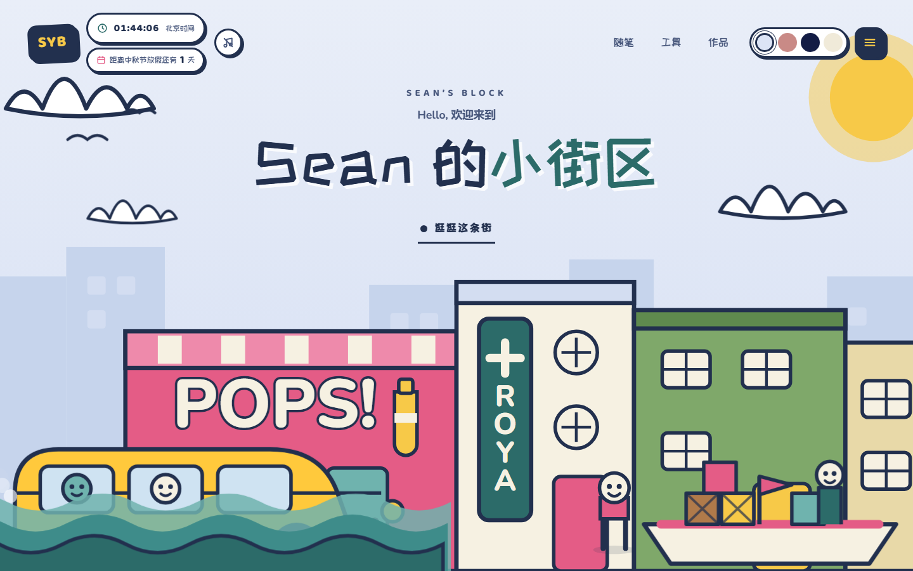
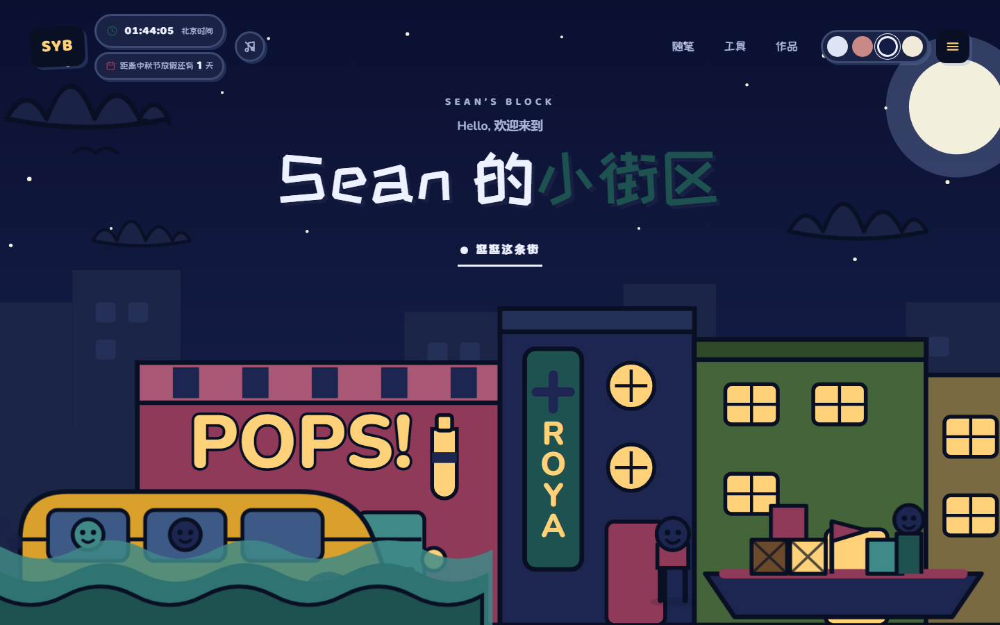

<div align="center">

# Sean 的小街区

把个人网站画成一条街：每栋楼是一个栏目，点一下就带你过去。

**手写 HTML / CSS / JavaScript · 零构建 · 零依赖 · 全站没有一张图片素材**

[**在线逛一逛 →**](https://shaoyibang.github.io)

</div>



<p align="center"><sub>白天配色。右上角四个圆点可以切到黄昏 / 夜晚 / 复古印刷 —— 同一套 SVG 只换变量，夜里窗户会亮。</sub></p>



---

## 这是什么

我是邵乙梆（Sean），在郑州写代码的初级全栈开发者。这个站点是我的练习场：**整页手绘 SVG、没有框架、没有构建步骤**，一边搭一边弄懂它为什么能跑。

写内容的原则是**不编数字**。作品页里没有"提升 40%""服务 5000+ 用户"这种话，因为确实还没有；那两个开源项目写明了是 fork 下来读源码的，不算自己的作品。

## 三个模块

| 模块 | 页面 | 里面有什么 |
| --- | --- | --- |
| **随笔** | `blog/` | 三篇文章：Bento 网格为什么这么耐看 / 做玩具，是检验设计直觉最快的方式 / 先让它不用 JS 也能用 |
| **工具** | `tools.html` | 三个纯 Canvas 小工具：涂鸦板（可导出 PNG）、贪吃蛇（方向键 / WASD / 触屏方向键）、生命游戏 |
| **作品** | `works.html` | 老实交代"现在有什么"：本站、三个工具，以及正在读源码的两个开源项目 |

首页从上到下也是这个顺序：**关于我 → 随笔 → 工具 → 作品 → 联系**。

## 街上能玩的东西

- **四套配色** —— 白天 / 黄昏 / 夜晚 / 复古印刷，选择写进 `localStorage`，翻页跟着走。
- **点楼看招牌** —— 街上的建筑都是可点区域，点一下弹出一块写着栏目名的招牌气泡，然后带你滚过去。
- **编号菜单** —— 右上角按钮或按 `M` 打开，`Esc` / 点遮罩 / 关闭按钮都能关，`Tab` 锁在弹窗里。
- **左上角北京时间** —— 按 UTC+8 算，跟访客在哪个时区无关；每秒走一格，标签页切到后台就停。
- **节假日倒计时** —— 时钟下面那行，自动挑下一个法定节假日（中秋过了变国庆，国庆过了变元旦）。
- **背景音乐开关** —— 音符按钮，**默认关闭**，不点就不会下载（`preload="none"`）；换页接着放，音量 85%。
- **车真的会开** —— 三层海浪视差、云朵浮动、公交沿街往返、船身上下轻微起伏。

## 本地跑起来

```powershell
# 方式一：直接双击
start index.html

# 方式二：起个本地服务（路径和相对链接的行为跟线上一致）
npx --yes serve . -l 4321
```

改完东西跑一下自检 —— 查断链、缺失的 `alt` / `aria-label`、`h1` 数量、`lang` / `viewport`：

```powershell
node tools/check.mjs
```

> 注意别搞混：**`tools/` 是放脚本的目录，`tools.html` 是「工具」那个页面**，两个东西。

## 部署

这个仓库就是站点本身：仓库名 `shaoyibang.github.io`，GitHub Pages 指向 `main` 分支根目录，推上去约一分钟自动重新构建。

```powershell
git add -A
git commit -m "改了什么"
git push
```

## 目录结构

```
.
├─ index.html                首页：手绘街区 + 编号菜单 + 四个区块
├─ works.html                作品
├─ tools.html                工具（三个 Canvas 小玩意）
├─ bento.html                备选首页：Bento 网格版，另一套皮肤（style.css + main.js）
├─ blog/
│  ├─ index.html             随笔列表
│  ├─ bento-layout.html      「Bento 网格为什么这么耐看」
│  ├─ toys-that-teach.html   「做玩具，是检验设计直觉最快的方式」
│  └─ no-js-first.html       「先让它不用 JS 也能用」
├─ assets/
│  ├─ css/illustrated.css    主样式：四套配色令牌 + 首页场景 + 全站内页组件
│  ├─ css/style.css          Bento 版专用样式
│  ├─ js/illustrated.js      配色 / 菜单 / 招牌彩蛋 / 场景适配 / 北京时间 / 倒计时 / 音乐
│  ├─ js/main.js             Bento 版交互
│  └─ js/tools.js            三个 Canvas 小工具（两个版本共用）
├─ docs/preview*.png         README 里的预览图
├─ music.mp3                 背景音乐（320kbps CBR / 44.1kHz / 2 分 56 秒）
├─ tools/check.mjs           自检脚本
└─ README.md
```

## 想改哪里

| 想改什么 | 改哪里 |
| --- | --- |
| 街上的建筑、公交、小船、海浪、云、星星 | `index.html` 里那一整块 `<svg>`，按注释分组 |
| 可点击的建筑 | `<g class="hotspot" data-goto="#works" data-label="作品" data-sub="…">`，三处一起改 |
| 招牌气泡的样子 | `illustrated.css` 的 `.sign`、`illustrated.js` 的 `showSign()` |
| 公交行驶速度 | `illustrated.css` 的 `@keyframes drive` 与 `.drive` |
| 菜单项 | `.menu__list` 里的 `li`：编号 / 中文名 / 英文名 |
| 首页区块的顺序 | `<main>` 里的区块注释。**只有「作品」是青色色带**，它前后各有一条 `.wave-div` 波浪，搬这个区块必须连波浪一起搬，否则色带边缘会露出直角 |
| 四套配色的颜色 | `illustrated.css` 顶部一个 `[data-palette="…"]` 块就是一套，新增一套只要加一块 |
| 左上角时钟 / 倒计时 | `illustrated.js` 的 `clock()` 与 `countdown()`，节假日表是里面那个 `HOLIDAYS`（一年一行，官方调休公布后改对应那行；表用完了会自动退回"明年元旦"） |
| 背景音乐 | 换文件就改 7 个页面的 `<audio id="bgm" src=…>`（`blog/` 下要写 `../`）；音量是 `illustrated.js` 里的 `VOLUME` |
| 浏览器标签页图标 | 每个 HTML `<head>` 里的 `rel="icon"`，是一段 URL 编码的 SVG data URI，改字母只动 `%3E…%3C` 之间的内容 |

## 技术选择

- **零构建零依赖**：除 Google Fonts 外没有任何第三方请求；字体被墙时回落到系统字体栈，布局不会跳。
- **配色令牌**：所有颜色都是 CSS 变量。深色下 `--ink`（给 SVG）和 `--edge`（给 HTML 边框）分开取色，否则夜里边框会糊在背景里。
- **全手绘 SVG**：四栋楼 + 公交 + 小船 + 三层海浪 + 云 + 星星 + 角色，都是代码画出来的，没有任何图片素材。
- **可访问性**：跳转链接、可见焦点环、图标按钮都有可访问名称、`role="dialog"` + 焦点陷阱与关闭后恢复、配色切换是标准 `radiogroup` 且支持方向键、全程尊重 `prefers-reduced-motion`。
- **字体**：中文标题 `ZCOOL KuaiLe`（自带手写感）+ 拉丁标题 `Baloo 2` + 正文 `Nunito`；Bento 版用 Space Grotesk / Archivo / JetBrains Mono。

## 踩过的坑（都修好了，改的时候别改回去）

1. **CSS `transform` 会覆盖 SVG 的 `transform` 属性**。带动画的元素必须外层套一个负责定位的 `<g transform="…">`，动画只加在内层 `<g>` 上，否则图形会塌到原点。公交的"定位 / 行驶 / 颠簸"就是三层 `<g>` 各管一件事。
2. **别给 `aria-hidden` 的装饰 SVG 里放 `tabindex` 元素**。街景整块是装饰性的，建筑只是鼠标用户的快捷入口；键盘和读屏用户走菜单，那条路径是完整的。
3. **`animation-delay` 用负值**。公交的循环有 58 秒，不加负延迟的话用户进页面要等十几秒才看到车。
4. **算北京时间别掺 `getTimezoneOffset()`**。时间戳直接 `+8h` 再用 `getUTC*` 读就是北京墙上时间；再减一次本机偏移得到的是 UTC —— 而本机正好在 UTC+8 时它"看着像对的"，差 8 小时还不容易被发现。
5. **`.reveal` 的隐藏态写在 `.js` 类下**（`html.js .reveal { opacity: 0 }`）。脚本挂了或被禁用时内容照样完整可读，不会变成一片空白。

## 还在路上

- 随笔那三篇是初稿，文风还在调整，想用自己的话再写一遍。
- `bento.html` 是早期的备选设计，留着当参考，还没决定去留。
- 想补 RSS / sitemap，以及一张 1200×630 的分享封面图。

---

代码随便参考；插画和文字是邵乙梆的。
