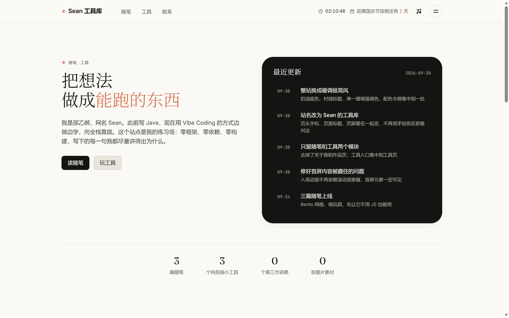
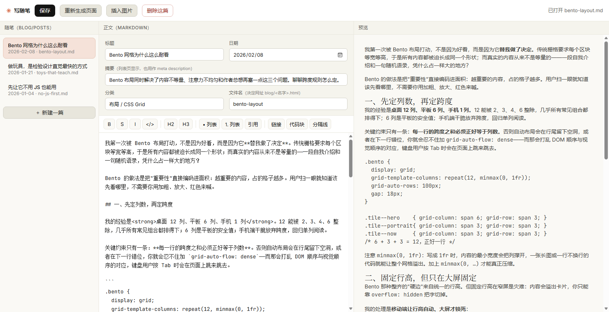

<div align="center">

# Sean 的工具库

写代码，也写下来为什么这么写。

**手写 HTML / CSS / JavaScript · 零构建 · 零依赖 · 全站没有一张图片素材**

[**在线看看 →**](https://shaoyibang.github.io)

</div>



<p align="center"><sub>暖调编辑风：奶油底色 + 衬线标题 + 单一珊瑚强调色。悬停时按钮长出一圈同色环，而不是变色。</sub></p>

---

## 这是什么

我是邵乙梆（Sean），在郑州写代码的初级全栈开发者。这个站点只做两件事：**写随笔、放几个小工具**。没有作品集，也没有自我介绍页——想了解我，看文章就行。

技术上它是我的练习场：**没有框架、没有构建步骤**，一边搭一边弄懂它为什么能跑。

字体的选择是有理由的：标题用衬线、正文用无衬线，而且**衬线标题比正文还轻**（字重 340 对 400）。这不是笔误——标题靠字号和衬线本身建立语气，加粗反而会变吵。

写内容的原则是**不编数字**。所以这里看不到"提升 40%""服务 5000+ 用户"这种话，因为确实还没有。

## 两个模块

| 模块 | 页面 | 里面有什么 |
| --- | --- | --- |
| **随笔** | `blog/` | 三篇文章：Bento 网格为什么这么耐看 / 做玩具，是检验设计直觉最快的方式 / 先让它不用 JS 也能用 |
| **工具** | `tools.html` | 三个纯 Canvas 小工具：涂鸦板（可导出 PNG）、贪吃蛇（方向键 / WASD / 触屏方向键）、生命游戏 |

首页只做一件事：把这两块按顺序铺开（随笔 → 工具 → 联系）。

## 设计语言

整套视觉是从 claude.com / anthropic.com 的**线上 CSS 令牌**反推出来的，不是照着截图估的。

| 项 | 值 | 说明 |
| --- | --- | --- |
| 页面底色 | `#faf9f5` | 暖奶油。全站不用纯白做底 |
| 卡片底色 | `#ffffff` | 比底色"抬起"一档，是层次的主要来源 |
| 正文色 | `#3d3d3a` | 最深也用 `#141413`，全站不用纯黑 |
| 次级文字 | `#5e5d59` | 说明、元信息 |
| 发丝线 | `#e8e6dc` | 1px，替代投影 |
| 强调色 | `#d97757` | clay。**全站唯一的强调色**，只给 logo 星标、文字选中、焦点环、整块色带 |
| 主按钮 | `#141413` 底 | 黑底奶油字。珊瑚色留给品牌按钮，不铺在主 CTA 上 |
| 圆角 | 按钮 8px / 卡片 16px / 面板 32px | 不是胶囊 |
| 投影 | 最重一层 ~10% alpha | 层次靠色块，不靠影子 |

字体（原版 Anthropic Serif / Sans / Mono 是自有字体，未授权再分发，所以用开源近似）：

| 用途 | 字体 | 替代谁 |
| --- | --- | --- |
| 标题衬线 | Fraunces（可变字重，按字号自动选光学尺寸） | Anthropic Serif |
| 中文衬线 | Noto Serif SC（按 unicode-range 分 101 个子集，只下载用到的那几个） | — |
| 正文无衬线 | Inter | Anthropic Sans |
| 等宽 | JetBrains Mono | Anthropic Mono |

换真字体时只需要改 `site.css` 顶部 `:root` 里的 `--font-display` / `--font-sans` / `--font-mono`。

## 街上能玩的东西

- **暖调单配色** —— 一套克制的奶油 + 珊瑚。原来的四套（白天/黄昏/夜晚/复古印刷）是给手绘街区用的，跟现在的语言冲突，已移除。配色仍然是 CSS 变量，新增一套只要加一个 `[data-palette]` 块。
- **编号菜单** —— 右上角按钮或按 `M` 打开，`Esc` / 点遮罩 / 关闭按钮都能关，`Tab` 锁在弹窗里，关闭后焦点回到触发按钮。
- **左上角北京时间** —— 按 UTC+8 算，跟访客在哪个时区无关；每秒走一格，标签页切到后台就停。
- **节假日倒计时** —— 时钟右边那行，自动挑下一个法定节假日（中秋过了变国庆，国庆过了变元旦）。
- **背景音乐开关** —— 音符按钮，**默认关闭**，不点就不会下载（`preload="none"`）；换页接着放，音量 85%。
- **首页的「最近更新」列表** —— 深色面板里那 3 条，与左侧文字栏等高。**这块是构建器生成的**：把 `blog/posts/*.md` 与 `tools/build.mjs` 里的 `TOOLS` 清单合并、按日期倒序取前 3 条，所以新增随笔或工具它会自己更新。要加减工具或改工具日期，改 `TOOLS` 数组。

## 写一篇随笔

随笔的源文件是 Markdown，放在 `blog/posts/`；页面由 `tools/build.mjs` 生成。发布出去的仍然是纯静态 HTML，浏览时不跑任何转换。

**用写作工具（推荐）**：

```powershell
node tools/editor.mjs
# 然后打开 http://127.0.0.1:4322
```

左边选文章、中间写、右边实时预览。工具条能加粗体、标题、列表、引用、代码块；标题、摘要、分类、文件名在同一页填。**图片直接拖进来或 Ctrl+V 粘贴**，会先在浏览器里压到长边 1600px 再转 WebP，然后存进 `assets/img/`，并把 Markdown 引用插到光标处。按 `Ctrl+S` 保存，保存时自动重新生成页面。

**想看效果**：顶栏的 **「打开主页 ↗」/「随笔列表 ↗」** 指向 `http://127.0.0.1:4322/site/…`，是同一台服务挂出来的站点预览，响应带 `no-store`。所以保存完点一下就是最新的，不用另起服务、也不用手动强刷。

> 注意：如果你习惯用别的地址看站点（比如另起的静态服务、或直接双击 HTML 文件），那边会有浏览器缓存，**加删文章后得手动刷新**才能看到。用顶栏那两个入口没这个问题。

顶栏的 **「删除这篇」** 会删掉 `blog/posts/<文件名>.md`，并连带移除页面、更新其它文章的「上一篇 / 下一篇」和随笔列表。删除前会二次确认；**新建但还没保存的文章不能删**（按钮置灰）。提交过的内容可以从 git 历史里找回。



> 这个服务只监听 `127.0.0.1`，外部访问不到；它不进线上站点，发布后不需要它。

**或者纯手工**：新建 `blog/posts/我的文章.md`，写好头部再跑生成器。

````markdown
---
title: 文章标题
date: 2026-09-30
summary: 一句话摘要（列表页显示，也用作 meta description）
lede: 正文开头那段导语
cats: 布局 / CSS Grid
slug: my-post
---

正文从这里开始。支持 ## 标题、**粗体**、`行内代码`、- 列表、> 引用，以及三反引号围起来的代码块。
图片写 。
````

几个容易踩的约定：

- **`slug` 必须和文件名一致**，它决定网址 `blog/<slug>.html`。
- **正文标题从 `##` 写起**。页面自身的文章标题已经是 `<h1>`，而每页只能有一个 —— 生成器会把正文标题整体降级，所以你写 `#` 也会渲染成 `<h2>`。
- 图片路径是**相对文章页**算的，所以要写 `../assets/img/…`。
- 阅读时长不写就按字数估算；想固定就在 front matter 里加 `minutes`。

```powershell
node tools/build.mjs          # 手动重新生成
node tools/build.mjs --check  # 只检查生成物是否与源同步（不写文件）
```

**生成器会写这些文件**：

| 文件 | 内容 |
| --- | --- |
| `blog/<slug>.html` | 每篇文章页 |
| `blog/index.html` | 随笔列表 |
| `index.html` | **只更新两处**：`<!-- journal:start/end -->` 之间的随笔列表，和 `<!-- stat:posts -->` 里的篇数 |
| 删除 | `blog/` 下没有对应 `.md` 的 `.html` 会被清掉，避免留下死页面 |

首页其余部分仍是手写的，生成时只替换上面那两处标记。文章一篇都没有时，首页那块会显示「还没有写过随笔」。

## 本地跑起来

```powershell
# 方式一：直接双击
start index.html

# 方式二：起个本地服务（路径和相对链接的行为跟线上一致）
npx --yes serve . -l 4321
```

改完东西跑一下自检：

```powershell
node tools/check.mjs          # 页面向外引用是否完整、有没有断链
node tools/md.test.mjs        # Markdown 转换器（含各种转义边界）
node tools/home.test.mjs      # 首页的随笔列表/篇数是否与 blog/posts/ 一致
node tools/build.mjs --check  # 生成物是否与 Markdown 源同步（不写文件）
```

最后两条是"防回归"用的，对应两个真实踩过的坑：删了文章首页还列着旧链接、以及生成物和源悄悄不同步。

> 注意别搞混：**`tools/` 是放脚本的目录，`tools.html` 是「工具」那个页面**，两个东西。

## 部署

这个仓库就是站点本身：仓库名 `shaoyibang.github.io`，GitHub Pages 指向 `main` 分支根目录，推上去约一分钟自动重新构建。

```powershell
git add -A
git commit -m "改了什么"
git push
```

## 目录结构

```
.
├─ index.html                首页：hero + 随笔 / 工具 / 联系
├─ tools.html                工具（三个 Canvas 小玩意）
├─ blog/
│  ├─ posts/*.md             随笔源文件（Markdown + front matter）—— 改内容改这里
│  ├─ index.html             随笔列表（生成）
│  └─ *.html                 每篇文章页（生成）
├─ assets/
│  ├─ css/site.css           唯一的样式表：设计令牌 + 全部组件
│  ├─ img/                   随笔里插入的图片（编辑器上传到这里）
│  ├─ js/site.js             全站交互：菜单 / 时钟 / 倒计时 / 音乐 / 入场
│  └─ js/tools.js            三个 Canvas 小工具
├─ docs/preview*.png         README 里的预览图
├─ music.mp3                 背景音乐（320kbps CBR / 44.1kHz / 2 分 56 秒）
├─ tools/
│  ├─ editor.mjs             本地写作服务（零依赖，只监听 127.0.0.1）
│  │                         同时在 /site/ 下挂出站点预览，保存完即见
│  ├─ editor/                写作界面：index.html / app.js / editor.css
│  ├─ md.mjs                 Markdown → HTML 转换器（编辑器与生成器共用）
│  ├─ md.test.mjs            转换器的单元测试
│  ├─ build.mjs              从 blog/posts/*.md 生成页面
│  ├─ check.mjs              自检：断链 / 结构 / 可达性
│  ├─ shots.mjs              抓 README 预览图（可选）
│  └─ verify.mjs             端到端验收（可选）
└─ README.md
```

> `blog/posts/*.md` 是**源**，`blog/*.html` 是**产物**。改内容只动 Markdown，再跑 `node tools/build.mjs`。

## 想改哪里

| 想改什么 | 改哪里 |
| --- | --- |
| 全站配色 | `site.css` 顶部 `:root` —— 改一处，全站跟着变 |
| 字体 | `site.css` 的 `--font-display` / `--font-sans` / `--font-mono`，以及各页 `<head>` 里的 Google Fonts 链接 |
| 按钮圆角、悬停效果 | `site.css` 的 `.btn` 系列。**悬停是加一圈同色环，不是改底色** |
| 首页 hero 文案 | `index.html` 的 `.hero__title` |
| 首页「最近更新」 | 生成物，**不要手改** `index.html` 里 `<!-- updates:start -->` 与 `<!-- updates:end -->` 之间的内容；要调内容就改 `tools/build.mjs` 的 `TOOLS`（工具日期）或写新随笔 |
| 菜单项 | `site.js` 与各页 `.menu__list` 里的 `li`：编号 / 中文名 / 英文名 |
| 左上角时钟 / 倒计时 | `site.js` 的 `clock()` 与 `countdown()`，节假日表是里面那个 `HOLIDAYS`（一年一行，官方调休公布后改对应那行；表用完了会自动退回"明年元旦"） |
| 背景音乐 | 换文件就改 7 个页面的 `<audio id="bgm" src=…>`（`blog/` 下要写 `../`）；音量是 `site.js` 里的 `VOLUME` |
| 浏览器标签页图标 | 每个 HTML `<head>` 里的 `rel="icon"`，是一段 URL 编码的 SVG data URI（S 字标）；文章页还要同步 `tools/build.mjs` 里的 `FAVICON` 常量 |
| 页头字标 | 各页 `.brand__mark`（内联 S 字标）；文章页还要同步 `tools/build.mjs` 里的 `BRAND_MARK` |
| 页面底部导航 / 页脚 | 各页 `.footer` |

## 技术选择

- **零构建零依赖**：除 Google Fonts 外没有任何第三方请求；字体被墙时回落到系统字体栈，布局不会跳。
- **设计令牌**：所有颜色、圆角、投影、缓动都是 CSS 变量。深色面板和奶油页面共用同一套令牌，只是取不同的变量。
- **中文衬线按需下载**：`Noto Serif SC` 用 `unicode-range` 分成 101 个子集，浏览器只抓页面上真正出现的那几个字所在的切片，不会整包下载。
- **零图片素材**：图标、头像、热力图、抽象面板全部是内联 SVG 或 CSS。
- **可访问性**：跳转链接、可见焦点环、图标按钮都有可访问名称、`role="dialog"` + 焦点陷阱与关闭后恢复、全程尊重 `prefers-reduced-motion`。
- **尺寸按字符算**：正文宽度用 `ch`（72ch），不写死 px，字号变了阅读宽度还合适。

## 踩过的坑（都修好了，改的时候别改回去）

1. **别让内容默认藏在 CSS 里**。`.reveal` 的隐藏态写在 `html.js` 下，而且脚本会先把"已经在视口内"的元素无条件显示出来，再交给 `IntersectionObserver`。只靠 observer 回调的话，一旦它没触发，首屏卡片会永远停在 `opacity: 0` —— 这个是实测踩到的，不是假设。
2. **衬线标题不要加粗**。这套语言的字重是反向的：标题 340，正文 400。加粗到 600/700 立刻变成另一种气质。
3. **悬停要"变厚"，不要"变色"**。主按钮悬停是长出一圈 `box-shadow: 0 0 0 2px` 的同色环；改成变深色就不像了。
4. **珊瑚色要省着用**。只给 logo 星标、文字选中、焦点环、整块色带和品牌按钮。主 CTA 是黑底。
5. **算北京时间别掺 `getTimezoneOffset()`**。时间戳直接 `+8h` 再用 `getUTC*` 读就是北京墙上时间；再减一次本机偏移得到的是 UTC —— 而本机正好在 UTC+8 时它"看着像对的"，差 8 小时还不容易被发现。
6. **`.toy__stage` 里的画布用绝对定位**。外层按 `width/height` 属性算出的比例撑开，画布 `inset: 0` 填满，再加一道 `max-height`，否则宽屏下一块画布能占满整屏。
7. **`em` 对中文标题会窄得离谱**。`max-width: 22em` 在拉丁字体下约等于 22 个字符宽，但 1em 只有半个汉字宽，中文标题会被挤成三行、末字单独掉一行。首页 hero 的 `max-width: 520px` 是按实测值定的（「做成能跑的东西」在 52px 下需要约 363px）。
8. **站名散在多个页面里，改的时候要一起改**。具体是每页的 `<title>`、页头的 `.brand` 字标、页脚署名，以及 `.menu__copy` 版权行；随笔页还有 `tools/build.mjs` 里的页面外壳（不改它，重新生成就会把旧站名写回来）。
9. **Markdown 里有两套"看起来一样"的代码写法，语义不同**。`` `a < b` `` 里写的是源码，会被转义；`<code>&lt;a&gt;</code>` 里写的是最终 HTML，原样保留。这两种刻意**没有**归一化 —— 强行统一必然有一边失真。同理，正文里可以直接写裸标签（`<a>`、`<strong>`、`<br>`），这是逃生口。
10. **`<pre>` 里的缩进是内容**。给生成结果统一缩进时（`indentBody`）必须跳过代码块内部的行，否则读者看到的代码会多出一层空格。
11. **删文章必须连页面一起收走**。生成器只写不删的话，删掉一篇随笔会在 `blog/` 留下一个孤儿 HTML —— 它不在列表里、没人访问得到，但会被部署上线。所以 `buildAll` 里加了孤儿清理：`blog/<slug>.html` 只要没有对应的 `blog/posts/<slug>.md` 就删掉。**不是**生成物的 HTML 不要往 `blog/` 放。
12. **首页上凡是"文章状态的投影"，都不要手写**。首页原先手写了随笔列表和篇数，结果删完三篇文章后，首页还列着那三篇已经不存在的文章，链接全断——自检才报出来。现在这两块由生成器按标记替换（`journal:start/end`、`stat:posts`）。**加新的这类区块时，同样走标记 + 生成，别手写。**

## 还在路上

- 随笔那三篇是初稿，文风还在调整，想用自己的话再写一遍。
- 想补 RSS / sitemap，以及一张 1200×630 的分享封面图。

---

代码随便参考；插画和文字是邵乙梆的。
